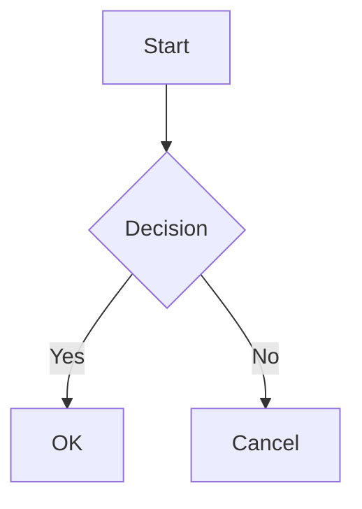

# Markdown Mermaid Zoom

Adds [Mermaid](https://mermaid.js.org/) diagram and flowchart support with **zoom**, **pan**, and **fullscreen** capabilities to VS Code's built-in Markdown preview.

Also available on the [Open VSX Registry](https://open-vsx.org/extension/EchEmLabs/markdown-mermaid-zoom) for **Cursor**, **VS Codium**, and other compatible editors.

All functionality runs entirely client-side inside the VS Code webview -- no server or external services required.

## Features

- **Mermaid Rendering** -- Renders mermaid diagrams inline in VS Code's built-in Markdown preview
- **Zoom In / Out** -- Zoom via buttons, Alt+scroll wheel, pinch-to-zoom on trackpad, or Alt+click
- **Pan** -- Click-and-drag to pan around large diagrams (Alt+drag by default, configurable)
- **Fullscreen Mode** -- Expand any diagram to a fullscreen overlay for detailed exploration
- **Vertical Resize** -- Drag the bottom edge of any diagram to adjust its height
- **Light/Dark Theme Support** -- Automatically uses appropriate Mermaid theme based on VS Code's color theme
- **Configurable Controls** -- Show/hide navigation controls, adjust mouse behavior, set max height

### Supported Diagram Types

Flowchart, Sequence, Gantt, Class, State, Pie, Entity Relationship, Mindmap, Git Graph, C4, User Journey, and all other Mermaid-supported diagram types.

## Installation

### From VS Code Marketplace

1. Open VS Code
2. Go to the Extensions view (`Ctrl+Shift+X` / `Cmd+Shift+X`)
3. Search for **"Markdown Mermaid Zoom"**
4. Click **Install**

### From Open VSX (Cursor / VS Codium)

The extension is published to the [Open VSX Registry](https://open-vsx.org/extension/EchEmLabs/markdown-mermaid-zoom), so it can be installed directly from the extension marketplace in **Cursor**, **VS Codium**, and other editors that use Open VSX.

1. Open the Extensions view (`Ctrl+Shift+X` / `Cmd+Shift+X`)
2. Search for **"Markdown Mermaid Zoom"**
3. Click **Install**

Or install from the command line:

```bash
# Cursor
cursor --install-extension EchEmLabs.markdown-mermaid-zoom

# VS Codium
codium --install-extension EchEmLabs.markdown-mermaid-zoom
```

### From VSIX

1. Download the `.vsix` file from the [GitHub Releases](https://github.com/hanzlamateen/markdown-mermaid-zoom/releases) page
2. In VS Code (or Cursor / VS Codium), open the Command Palette (`Ctrl+Shift+P`) and run **Extensions: Install from VSIX...**
3. Select the downloaded `.vsix` file

## Usage

### Mermaid Code Fences

Create diagrams in Markdown using fenced code blocks with the `mermaid` language identifier:

~~~markdown

~~~

### Colon Blocks

You can also use `:::` blocks:

```markdown
::: mermaid
graph TD;
    A-->B;
    A-->C;
    B-->D;
    C-->D;
:::
```

### Navigating Diagrams

#### Zooming

- **Zoom controls** -- Use the `+` and `-` buttons in the control bar
- **Scroll wheel** -- Hold `Alt` (Option on Mac) and scroll to zoom
- **Pinch-to-zoom** -- Use a trackpad pinch gesture
- **Click zoom** -- `Alt+click` to zoom in, `Alt+Shift+click` to zoom out

#### Panning

- **Click and drag** -- Hold `Alt` and click-drag to pan
- **Pan mode** -- Click the pan mode button (move icon) to enable free panning without holding Alt

#### Fullscreen

- Click the **fullscreen** button (expand icon) in the control bar to enter fullscreen mode
- In fullscreen, you get dedicated zoom/pan controls and a reset button
- Press `Escape` or click the **exit fullscreen** button to return to inline view

#### Resizing

- Drag the bottom edge of any diagram to resize it vertically
- Useful when combined with `markdownMermaidZoom.maxHeight`

## Configuration

All settings are under the `markdownMermaidZoom` namespace.

| Setting | Type | Default | Description |
|---------|------|---------|-------------|
| `markdownMermaidZoom.lightModeTheme` | enum | `"default"` | Mermaid theme for light VS Code themes. Options: `base`, `forest`, `dark`, `default`, `neutral` |
| `markdownMermaidZoom.darkModeTheme` | enum | `"dark"` | Mermaid theme for dark VS Code themes. Options: `base`, `forest`, `dark`, `default`, `neutral` |
| `markdownMermaidZoom.languages` | array | `["mermaid"]` | Language identifiers for mermaid code blocks |
| `markdownMermaidZoom.maxTextSize` | number | `50000` | Maximum allowed diagram text size |
| `markdownMermaidZoom.mouseNavigation` | enum | `"alt"` | When mouse navigation is enabled: `always`, `alt`, or `never` |
| `markdownMermaidZoom.controls.show` | enum | `"onHoverOrFocus"` | When to show control buttons: `never`, `onHoverOrFocus`, or `always` |
| `markdownMermaidZoom.fullscreen` | boolean | `true` | Enable the fullscreen toggle button |
| `markdownMermaidZoom.resizable` | boolean | `true` | Allow vertical resize by dragging bottom edge |
| `markdownMermaidZoom.maxHeight` | string | `""` | Maximum diagram height (e.g., `"400px"`, `"80vh"`). Empty = no limit |

### Example Settings

```json
{
  "markdownMermaidZoom.darkModeTheme": "forest",
  "markdownMermaidZoom.mouseNavigation": "always",
  "markdownMermaidZoom.controls.show": "always",
  "markdownMermaidZoom.maxHeight": "500px"
}
```

## Development

### Prerequisites

- [Node.js](https://nodejs.org/) >= 18
- [VS Code](https://code.visualstudio.com/) >= 1.75.0

### Setup

```bash
# Clone the repository
git clone https://github.com/hanzlamateen/markdown-mermaid-zoom.git
cd markdown-mermaid-zoom

# Install dependencies
npm install

# Build the extension
npm run build
```

### Running & Debugging

1. Open the project in VS Code
2. Press `F5` to launch the Extension Development Host
3. Open any Markdown file with mermaid code blocks to test

### Build Scripts

| Command | Description |
|---------|-------------|
| `npm run build` | Build both extension and preview |
| `npm run compile-ext` | Build extension host only |
| `npm run build-preview` | Build preview webview only |
| `npm run watch-ext` | Watch and rebuild extension on changes |
| `npm run watch-preview` | Watch and rebuild preview on changes |
| `npm run lint` | Run ESLint |
| `npm run compile-tests` | Compile test files |
| `npm test` | Run tests |

### Project Structure

```
src/
  extension/        Extension host (registers markdown-it plugin)
    index.ts        activate() entry point
    config.ts       Config reader and injector
  preview/          Markdown preview webview
    index.ts        Initializes mermaid, renders diagrams
  shared/           Shared between extension and preview
    markdownItMermaid.ts   markdown-it plugin
    mermaidRenderer.ts     Mermaid rendering logic
    diagramManager.ts      Pan/zoom/fullscreen manager
    diagramStyles.css      Styles for controls and overlays
    config.ts              Shared config types
build/              esbuild build scripts
test/               Test suite and fixtures
```

## Publishing

This project includes GitHub Actions for automated publishing to both the **VS Code Marketplace** and the **Open VSX Registry** (used by Cursor, VS Codium, etc.).

### 1. Create a VS Code Marketplace Publisher Account

1. Go to the [Visual Studio Marketplace Publisher Management](https://marketplace.visualstudio.com/manage) page
2. Sign in with your Microsoft account (or create one)
3. Click **Create Publisher** and fill in the details
4. Note your **publisher ID** -- update the `"publisher"` field in `package.json` to match

### 2. Create a VS Code Marketplace Personal Access Token (PAT)

1. Go to [Azure DevOps](https://dev.azure.com/) and sign in
2. Click on your profile icon (top right) and select **Personal access tokens**
3. Click **+ New Token**
4. Configure the token:
   - **Name**: `vsce-publish` (or any name)
   - **Organization**: Select **All accessible organizations**
   - **Scopes**: Click **Custom defined**, then click **Show all scopes** and check **Marketplace > Manage**
   - **Expiration**: Set as needed (max 1 year)
5. Click **Create** and **copy the token** (you will not be able to see it again)

### 3. Create an Open VSX Access Token

1. Go to [Open VSX](https://open-vsx.org/) and sign in with your GitHub account
2. Go to your [Access Tokens](https://open-vsx.org/user-settings/tokens) page
3. Click **Generate New Token**
4. Give it a description (e.g., `github-actions`) and click **Generate**
5. Copy the token (you will not be able to see it again)

### 4. Add Secrets to GitHub

1. Go to your GitHub repository's **Settings** > **Secrets and variables** > **Actions**
2. Add the following repository secrets:

| Secret Name | Value |
|-------------|-------|
| `VSCE_PAT` | Your VS Code Marketplace PAT (from step 2) |
| `OVSX_PAT` | Your Open VSX access token (from step 3) |

### 5. Create a Release

To publish a new version:

```bash
# Update version in package.json (e.g., 0.2.0)
npm version patch  # or minor/major

# Push the tag
git push origin --tags
```

The **Release** GitHub Action will automatically:
1. Build and test the extension
2. Package it as a `.vsix` file
3. Publish to the VS Code Marketplace
4. Publish to the Open VSX Registry
5. Upload the `.vsix` to GitHub Releases

### Manual Publishing

To publish manually without GitHub Actions:

```bash
# Install tools
npm install -g @vscode/vsce ovsx

# Package
vsce package

# Publish to VS Code Marketplace
vsce publish -p <your-vsce-pat>

# Publish to Open VSX
ovsx publish *.vsix -p <your-ovsx-token>
```

## Troubleshooting

### Diagrams fail to render after switching files

If diagrams render correctly the first time but show errors like **"No diagram type detected"** on subsequent previews, you most likely have a **conflicting Mermaid extension** installed.

**Known conflicting extensions:**

| Extension | Identifier |
|-----------|------------|
| Mermaid Chart | `mermaidchart.vscode-mermaid-chart` |
| Markdown Preview Mermaid Support | `bierner.markdown-mermaid` |

These extensions inject their own Mermaid.js instance into the same markdown preview webview. Two Mermaid instances running in the same webview corrupt each other's internal diagram detector registry, causing renders to fail after a few previews.

**Fix:** Disable or uninstall the conflicting extension. Only one Mermaid preview extension should be active at a time.

To check which extensions might conflict:

1. Open the Command Palette (`Ctrl+Shift+P`)
2. Run **"Extensions: Show Installed Extensions"**
3. Search for `mermaid`
4. Disable any other Mermaid-related preview extensions

### Controls (zoom/pan/fullscreen) not appearing

If diagrams render but the control buttons are missing, ensure the setting `markdownMermaidZoom.controls.show` is not set to `"never"`. The default value `"onHoverOrFocus"` shows controls when you hover over a diagram.

## Contributing

1. Fork the repository
2. Create a feature branch (`git checkout -b feature/my-feature`)
3. Make your changes
4. Run tests (`npm test`)
5. Commit your changes (`git commit -am 'Add my feature'`)
6. Push to the branch (`git push origin feature/my-feature`)
7. Open a Pull Request

## Acknowledgments

Inspired by:
- [vscode-markdown-mermaid](https://github.com/mjbvz/vscode-markdown-mermaid) by Matt Bierner
- [vscode-mermaid-chart](https://github.com/Mermaid-Chart/vscode-mermaid-chart) by Mermaid Chart
- [mermaid](https://github.com/mermaid-js/mermaid) by the Mermaid.js team

## License

[MIT](LICENSE)
