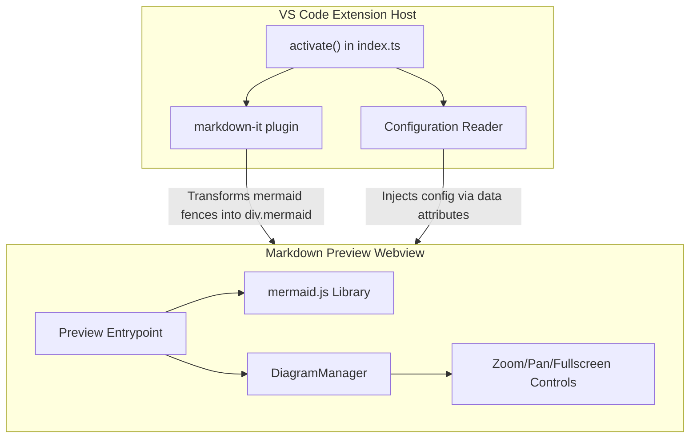

# Markdown Mermaid Zoom - Architecture Spec

## Architecture Overview

The extension follows the same pattern as [vscode-markdown-mermaid](https://github.com/mjbvz/vscode-markdown-mermaid): a **markdown-it plugin** that hooks into VS Code's built-in markdown preview. There is no server component; all rendering is done client-side in the webview.




**Key components:**

- **Extension host** (`src/extension/`): Registers the markdown-it plugin that converts mermaid code fences into `<pre class="mermaid">` containers with `data-mermaid-source` attributes, and injects configuration.
- **Preview webview** (`src/preview/`): Runs inside the markdown preview. Initializes mermaid.js, renders diagrams, and attaches the DiagramManager for zoom/pan/fullscreen.
- **Shared code** (`src/shared/`): The markdown-it plugin logic for parsing mermaid fences.
- **Build system**: esbuild for both the extension host (CJS, Node) and the webview preview (IIFE, browser).

## Project Structure

```
markdown-mermaid-zoom/
  .github/
    workflows/
      ci.yml              # Lint, test, build on every PR/push
      release.yml          # Package and publish to marketplace on tag
  .vscode/
    launch.json            # Extension debug configs
    settings.json          # Workspace settings
    tasks.json             # Build tasks
  build/
    esbuild-extension.mjs  # Build script for extension host
    esbuild-preview.mjs    # Build script for preview webview
    package.json           # {"type": "module"} for build scripts
  src/
    extension/
      index.ts             # activate() - registers markdown-it plugin + config
      config.ts            # Reads workspace config, injects into preview
      tsconfig.json
    preview/
      index.ts             # Preview entrypoint - initializes mermaid, renders diagrams
      tsconfig.json
    shared/
      markdownItMermaid.ts # markdown-it plugin that parses mermaid code fences
      mermaidRenderer.ts   # Shared mermaid rendering logic
      diagramManager.ts    # Pan, zoom, fullscreen manager for each diagram
      diagramStyles.css    # CSS for controls, wrapper, fullscreen overlay
      config.ts            # Shared config types and enums
      tsconfig.json
    tsconfig.base.json     # Shared TypeScript config
  test/
    suite/
      extension.test.ts    # Integration tests for markdown-it plugin
      mermaidRender.test.ts # Tests verifying various diagram types render
    fixtures/
      flowchart.md         # Test markdown files with mermaid diagrams
      sequence.md
      gantt.md
      classDiagram.md
      stateDiagram.md
      pie.md
      erDiagram.md
      mindmap.md
    runTests.ts            # VS Code test runner entry
  docs/
    logo.png               # Extension icon
  .editorconfig
  .gitignore
  .vscodeignore
  package.json             # Extension manifest
  package-lock.json
  tsconfig.json
  eslint.config.mjs
  CHANGELOG.md
  LICENSE
  README.md
```

## Key Implementation Details

### 1. Extension Manifest (`package.json`)

- `**contributes.markdown.previewScripts**`: Points to the bundled preview script (`./dist-preview/index.bundle.js`) so VS Code loads it into the markdown preview webview.
- `**contributes.markdown.markdownItPlugins**`: Set to `true` so `activate()` can return the markdown-it plugin.
- `**contributes.configuration**`: Exposes settings for light/dark theme, zoom behavior, fullscreen toggle, max height, controls visibility.
- **Engine**: `"vscode": "^1.75.0"` for broad compatibility.
- **Dependencies**: `mermaid` (runtime, bundled into preview), `esbuild` (dev), `@vscode/codicons` (dev, for button icons).

### 2. Fullscreen Feature (Key Differentiator)

Based on the attached screenshot showing a fullscreen button (expand icon) in the top-right control bar, each diagram will have a fullscreen toggle:

- Clicking the expand button creates a fixed-position overlay (`position: fixed; inset: 0; z-index: 9999`) covering the entire preview viewport.
- The overlay contains the diagram at full size with its own zoom/pan controls plus an "exit fullscreen" (collapse) button.
- Pressing `Escape` or clicking the collapse button returns to inline view.
- The zoom/pan state is preserved when entering/exiting fullscreen.

The controls bar will show 4 buttons matching the screenshot: **Pan Mode**, **Zoom In**, **Zoom Out**, **Fullscreen Toggle**.

### 3. Zoom and Pan

Implemented in `DiagramManager` / `DiagramElement` classes:

- **Mouse scroll zoom**: Alt+scroll (or always, configurable) applies CSS `transform: scale()` centered on cursor position.
- **Pinch-to-zoom**: Trackpad gesture support via `ctrlKey` detection on wheel events.
- **Button zoom**: +/- buttons zoom from viewport center by 1.25x / 0.8x factors.
- **Pan**: Alt+click-drag (or always, configurable) translates the diagram via CSS `transform: translate()`.
- **Reset**: Button resets scale to 1 and re-centers the diagram.
- Scale range: 0.5x to 10x.

### 4. Configuration Settings


| Setting                               | Type    | Default            | Description                          |
| ------------------------------------- | ------- | ------------------ | ------------------------------------ |
| `markdownMermaidZoom.lightModeTheme`  | enum    | `"default"`        | Mermaid theme for light mode         |
| `markdownMermaidZoom.darkModeTheme`   | enum    | `"dark"`           | Mermaid theme for dark mode          |
| `markdownMermaidZoom.languages`       | array   | `["mermaid"]`      | Language IDs for mermaid code blocks |
| `markdownMermaidZoom.maxTextSize`     | number  | `50000`            | Max diagram text size                |
| `markdownMermaidZoom.mouseNavigation` | enum    | `"alt"`            | When mouse nav is enabled            |
| `markdownMermaidZoom.controls.show`   | enum    | `"onHoverOrFocus"` | When to show control buttons         |
| `markdownMermaidZoom.fullscreen`      | boolean | `true`             | Enable fullscreen button             |
| `markdownMermaidZoom.resizable`       | boolean | `true`             | Allow vertical resize                |
| `markdownMermaidZoom.maxHeight`       | string  | `""`               | Max diagram height (CSS value)       |


### 5. Build System

Two esbuild scripts under `build/`:

- `**esbuild-extension.mjs`**: Bundles `src/extension/index.ts` to `dist/index.js` (CJS, Node platform). Externalizes `vscode`.
- `**esbuild-preview.mjs`**: Bundles `src/preview/index.ts` to `dist-preview/index.bundle.js` (IIFE, browser platform). Includes a CSS-text plugin to inline `diagramStyles.css`. Bundles mermaid.js and codicons.

`vscode:prepublish` runs both builds in production mode (minified, no sourcemaps).

### 6. GitHub Actions

`**ci.yml`** (on push/PR to main):

- Checkout, setup Node 20, `npm ci`
- Run `npm run lint`
- Run `npm run build` (compile extension + preview)
- Run `npm test` (VS Code integration tests via `@vscode/test-electron`)

`**release.yml**` (on tag push `v*`):

- Same build steps as CI
- Install `@vscode/vsce`
- Run `vsce package` to create `.vsix`
- Run `vsce publish` using `VSCE_PAT` secret (Personal Access Token from Azure DevOps)
- Upload `.vsix` as GitHub Release artifact

### 7. Tests

Using `@vscode/test-electron` and Mocha:

- **Markdown-it plugin test**: Verify that mermaid code fences are transformed into `<pre class="mermaid">` elements with `data-mermaid-source` attributes and correct content.
- **Diagram type tests**: Fixture markdown files containing flowchart, sequence, gantt, class, state, pie, ER, and mindmap diagrams. Tests verify the plugin correctly parses each type.
- **Configuration test**: Verify custom language IDs are respected.

### 8. README

Comprehensive README covering:

- Feature overview with screenshots
- Installation from marketplace
- Usage (mermaid code fences, ::: blocks)
- Navigating diagrams (zoom, pan, fullscreen)
- All configuration settings with descriptions
- Development setup (clone, npm install, F5 to debug)
- GitHub Actions setup for publishing (creating Azure DevOps PAT, adding VSCE_PAT secret, creating publisher account)
- Contributing guide
- License (MIT)

